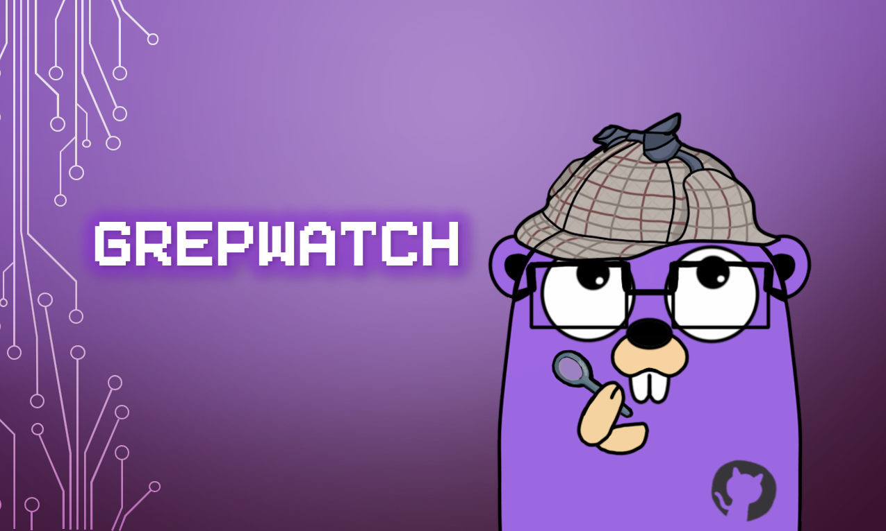



# grepWatch

**Catch malicious dependency updates before they reach production!**

*Forget AI! 2026 is the year of the supply chain attack!*

grepWatch is an open-source dependency behavioral diff engine. It watches package registeries across six ecosystems and flags when a new release *changes* in suspicious ways. (e.g. new outbound network calls, added obfuscation, high-entropy strings consistent with encoded payloads, and install-time execution hooks)

Detects malicious changes in packages by diffing versions over time — catching supply chain attacks before you ship them.

This checks across the following ecosystems:
- npm
- PyPI
- Go
- Cargo
- Maven
- NuGet

## Hosted version

A hosted instance runs at **[grepwatch.com](https://grepwatch.com)** with a live feed of findings — no setup required. Self-hosting is fully supported and documented below for anyone who wants to run their own instance.

## How it works

grepWatch runs as two services that share a Postgres database:

- **Worker**: on a fixed interval, crawls each registry for recently published versions, fetches the source for the new version and its predecessor, runs a set of static-analysis checks against the diff, scores anything suspicious, and persists findings.
- **Web**: serves a REST API and a Server-Sent Events stream that powers the live feed of findings.

## Self-hosting

### Requirements

- Go 1.25+
- PostgreSQL 14+

### Configuration

Both services read configuration from the environment:

| Variable | Required | Description |
|---|---|---|
| `DATABASE_URL` | yes | Postgres connection string (`postgres://...`) |
| `PORT` | web only | Port for the web server (defaults to 8080) |

### Running

```bash
DATABASE_URL=postgres://... go run ./cmd/worker

DATABASE_URL=postgres://... PORT=8080 go run ./cmd/web
```

The worker creates its schema automatically on first run.

## License

AGPL-3.0 — see [LICENSE](LICENSE). You're free to self-host and modify. If you run a modified version as a network service, the AGPL requires you to make your source available to its users.
